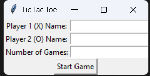
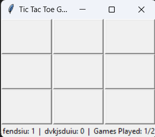

# Tic Tac Toe Game

This is a simple implementation of the classic Tic Tac Toe game with a graphical user interface (GUI) built using the `tkinter` library in Python.

## Features

- Play Tic Tac Toe with two players, represented by the symbols 'X' and 'O'.
- Players can enter their names before starting the game.
- Specify the number of games to play together, and the winner is determined by the player with the most wins.
- A "Play Again" feature is available after each game ends.

## Getting Started

1. Clone this repository to your local machine using git clone https://github.com/Bisalkumar/Number_guessing.git

2. Navigate to the project directory:  cd tic-tac-toe-game

3. Install any necessary dependencies. Make sure you have Python and tkinter installed.

4. Run the game: python tic_tac_toe.py

5. Enter the names of the two players and the number of games to play.

6. Click the "Start Game" button to begin playing.

--------------------------
## How to Play

Players take turns to place their symbol on the grid by clicking the available cells.
The goal is to be the first to complete a row, column, or diagonal with your symbol.
After each game, the scores are displayed, and a winner is declared based on the most wins in the series.

----------------

## Screenshots

## Contributions
Contributions are welcome! If you'd like to add new features, fix bugs, or improve the game in any way, feel free to create a pull request.

## License
This project is licensed under the MIT License. See LICENSE for more details.

## Acknowledgements
This game was created as a fun project to practice Python programming and GUI development using tkinter.

Have fun playing Tic Tac Toe with your friends! If you have any questions or need assistance, feel free to open an issue.